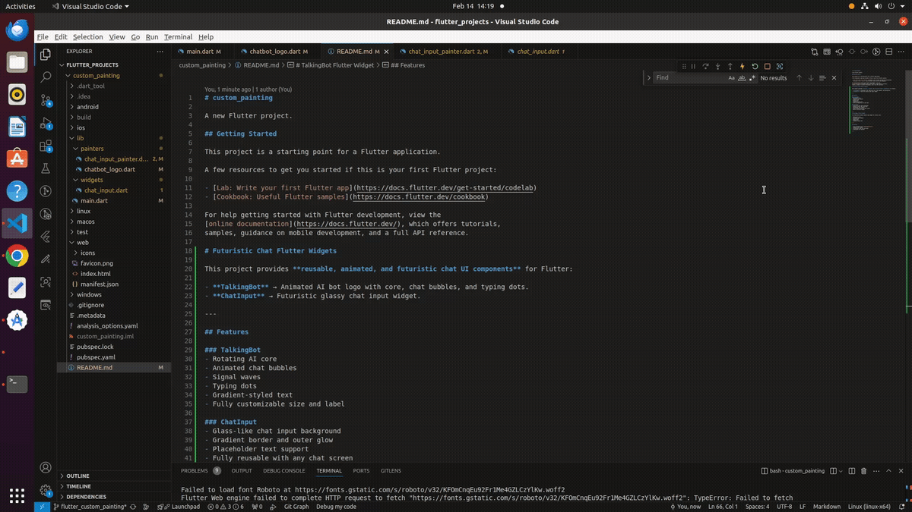

# custom_painting

A new Flutter project.

## Getting Started

This project is a starting point for a Flutter application.

A few resources to get you started if this is your first Flutter project:

- [Lab: Write your first Flutter app](https://docs.flutter.dev/get-started/codelab)
- [Cookbook: Useful Flutter samples](https://docs.flutter.dev/cookbook)

For help getting started with Flutter development, view the
[online documentation](https://docs.flutter.dev/), which offers tutorials,
samples, guidance on mobile development, and a full API reference.

# Futuristic Chat Flutter Widgets

This project provides **reusable, animated, and futuristic chat UI components** for Flutter:

- **TalkingBot** → Animated AI bot logo with core, chat bubbles, and typing dots.
- **ChatInput** → Futuristic glassy chat input widget.

---


## Demo

Here is a GIF demo of the **TalkingBot in action**:



**GIF location in project:**  
assets/gifs/screencast_clear.gif

## Features

### TalkingBot
- Rotating AI core
- Animated chat bubbles
- Signal waves
- Typing dots
- Gradient-styled text
- Fully customizable size and label

### ChatInput
- Glass-like chat input background
- Gradient border and outer glow
- Placeholder text support
- Fully reusable with any chat screen
- Modern futuristic design

---

# TalkingBot Flutter Widget

A customizable animated chatbot logo widget for Flutter with:

- Rotating AI core
- Pulsating chat bubbles
- Signal waves
- Typing dots
- Gradient-styled text

---

## Features

- Fully animated using `AnimationController`
- Gradient text support
- Customizable logo size and label
- Lightweight and reusable

---


💡 **Note:** To display the GIF in your Flutter app, make sure your `pubspec.yaml` includes:

```yaml
flutter:
  assets:
    - assets/gifs/screencast_clear.gif

